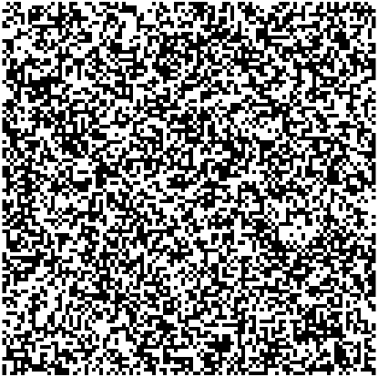

# Another name
What happens?

## Section 1

This is a test to see what paragraphs will look like. I need some text which is long enough to take up more than one line. I need some text which is long enough to take up more than one line. I need some text which is long enough to take up more than one line. I need some text which is long enough to take up more than one line.
And here is a line break.

With *emphasis*.

## Section 2

1. Ordered list entry 1
2. Ordered list entry 2

- Unordered list entry 1
- Unordered list entry 2

    Second line
- 3rd entry

A | B | C

A | B | C
---- | ----- | -----
D | E | F

## Section 3

